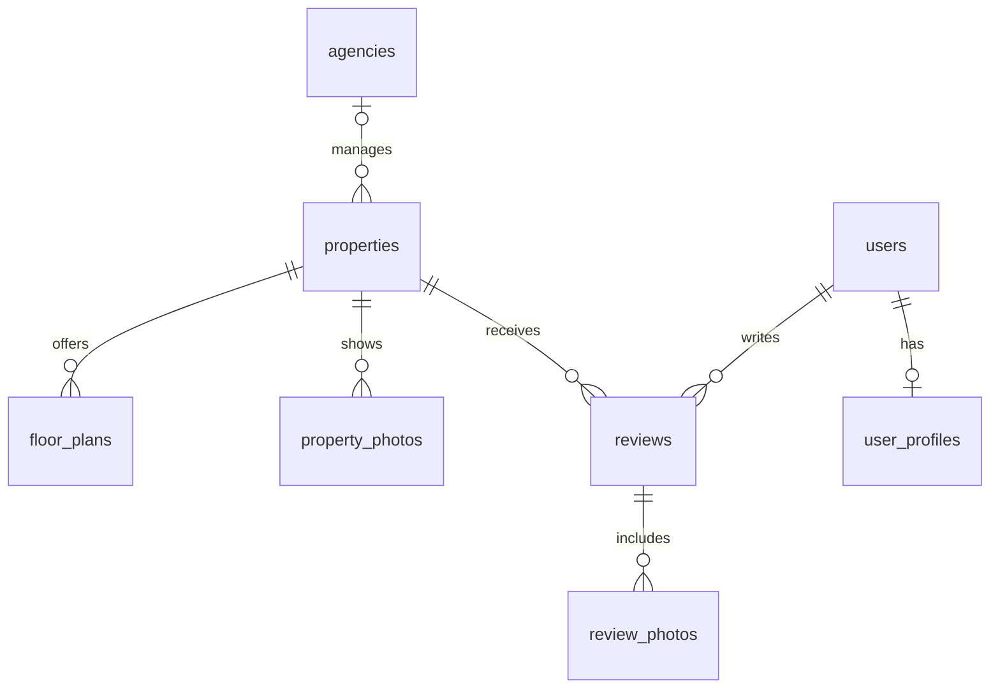

# Mountaineer Housing Hub - Backend

The backend uses TypeScript, Express, MySQL (`mysql2`), and Better Auth.
Redis and object storage are configured separately for the application.

Sign-in is Google OAuth only, restricted to verified `@appstate.edu` addresses.
The Google provider requires the `appstate.edu` hosted-domain claim, and the
server validates the exact email domain for new users, account linking, and
returning sign-ins. Email/password authentication is explicitly disabled.
Google supplies email verification; no separate verification email is sent.

Keep the `verification` table: Better Auth's current database-backed OAuth flow
stores temporary state/PKCE information there, and the configured `oneTimeToken`
plugin also uses it. The table name does not mean users must verify their email
again. See [Better Auth's state storage documentation](https://better-auth.com/docs/reference/options).

## Database design



| Table | One row represents |
| --- | --- |
| `agencies` | A management company, which can manage one or many properties |
| `properties` | A named apartment community, townhome development, or standalone rental |
| `floor_plans` | An advertised layout at a property, with bedrooms, bathrooms, and monthly rent |
| `users` | A private Better Auth user record |
| `user_profiles` | A user's public username |
| `reviews` | One user's editable review of one property |
| `property_photos`, `review_photos` | An image URL and its display order; image files live in object storage |

For your examples, The Standard at Boone is a property. If its management company
is known, link it to an agency, even if that agency only has one property in the
directory. Otherwise leave `agency_id` NULL. Do not create a duplicate agency
solely because a property is standalone. High Country Rentals would have one
agency row and a separate property row for each community or standalone rental.
"Apartment complexes" and "townhomes" are property types, not properties.
These examples illustrate the model; they are not verified ownership records.

`agency_id` means **current managing agency**. Ownership and management history
can become separate tables later if the project needs them. A NULL agency means
there is no linked agency yet; it does not prove a property is independently owned.

Floor plans avoid duplicating a community just because it offers several layouts.
Bedrooms describe the entire layout (0 means studio). `rent_basis` explicitly
distinguishes a price per bedroom from a price for the whole unit. Prices are
monthly USD decimals; format `$900/month` in the frontend. Use NULL for unknown
prices, both bounds equal for an exact price, or only `rent_min` for "starting at".
These are advertised prices, not live availability or individual lease records.

Properties start as `draft`; reviews start as `pending`. Public queries must
explicitly select `published` records. One review per user/property is enforced
with a unique key; editing updates that row. Compute ratings from published
reviews so hidden reviews do not affect scores. Agency reviews, favorites,
amenities, and individual units can be added later without changing this core.

## Create a development database

Use MySQL 8.0.16 or newer (a current MySQL 8.x release is preferable). The schema
uses enforced CHECK constraints and the MySQL `utf8mb4_0900_ai_ci` collation;
it is not intended for SQLite or MariaDB.

Install backend dependencies with `npm ci`. From the **backend directory**, open
the MySQL client with a database user allowed to create tables:

```powershell
mysql -h localhost -P 3306 -u YOUR_MYSQL_USER -p
```

Then run:

```sql
CREATE DATABASE mountaineer_housing_hub
  CHARACTER SET utf8mb4 COLLATE utf8mb4_0900_ai_ci;
USE mountaineer_housing_hub;
SOURCE src/db/schemas/init.sql;
SHOW TABLES;
```

The bootstrap creates 12 tables, including Better Auth's session, account,
verification, and rate-limit tables. `SOURCE` is a MySQL client command, not SQL
that can be passed to `mysql2.query()`. In a GUI database tool, select the database
and execute the six files listed in `init.sql` in that order.

Run this only on an empty database. There are intentionally no DROP statements
or `IF NOT EXISTS` clauses hiding differences in existing schemas. MySQL DDL is
not transactionally rolled back: if initialization fails, inspect the error and
the tables already created before continuing. Future changes need numbered
`ALTER TABLE` migrations; editing a bootstrap file does not update a teammate's
existing database. Do not run this against an existing auth database unchanged.

The SQL mirrors the current `auth/policy.ts` mappings and installed Better Auth
schema. All IDs and foreign keys use signed INT, matching `generateId: "serial"`.
Recheck the [Better Auth generated schema](https://better-auth.com/docs/concepts/cli)
when changing plugins or upgrading authentication. Better Auth manages passwords
and tokens; imports should not create real user accounts directly.

Database access uses `MYSQL_HOST`, `MYSQL_PORT`, `MYSQL_USERNAME`,
`MYSQL_PASSWORD`, and `MYSQL_DBNAME` in `.env`. Starting the full backend also
requires the other variables validated in `src/config.ts`; database bootstrap
does not require running Express, Redis, Google OAuth, or object storage.

## Google Sheet layout

Use separate tabs with these headers. Add optional schema columns as you collect
them. Stable lowercase slugs (for example `the-standard-at-boone`) connect tabs;
numeric database IDs are assigned when importing.

| Tab | Suggested columns |
| --- | --- |
| Agencies | `slug`, `name`, `website_url`, `phone`, `email` |
| Properties | `slug`, `agency_slug`, `name`, `property_type`, `address_line1`, `city`, `state`, `postal_code`, `website_url`, `source_url`, `last_verified_at` |
| Floor plans | `property_slug`, `name`, `bedrooms`, `bathrooms`, `square_feet`, `rent_min`, `rent_max`, `rent_basis`, `source_url`, `last_verified_at` |
| Property photos (optional) | `property_slug`, `image_url`, `alt_text`, `sort_order` |

- Use one row per entity, not comma-separated lists of properties or floor plans.
- Use the exact property types from `properties.sql` and rent bases from
  `floor_plans.sql`. A mixed community can use `other` initially.
- Leave unknown optional values blank; imports should convert blanks to NULL.
- Use numbers without dollar signs for rent and ISO dates (`YYYY-MM-DD`).
- Import agencies first, resolve `agency_slug` to an ID for properties, then
  resolve `property_slug` for floor plans/photos. Reject unresolved nonblank
  slugs; do not silently lose a relationship. Slug columns are import helpers,
  not duplicate columns in the database.
- Keep reviews and private user data out of the research spreadsheet. Collect
  reviews through authenticated application endpoints later.

An importer is not included yet; this structure gives your group a consistent
format to collect while the dataset is still being assembled.

## Queries and application responsibilities

List published properties, including those without an agency:

```sql
SELECT p.id, p.name, p.slug, p.property_type, a.name AS agency_name
FROM properties AS p
LEFT JOIN agencies AS a ON a.id = p.agency_id
WHERE p.status = 'published'
ORDER BY p.name;
```

Get review counts and average ratings without mixing in unpublished reviews:

```sql
SELECT p.id, p.name, COUNT(r.id) AS review_count, AVG(r.rating) AS average_rating
FROM properties AS p
LEFT JOIN reviews AS r ON r.property_id = p.id AND r.status = 'published'
WHERE p.status = 'published'
GROUP BY p.id, p.name;
```

No reviews produces a NULL average, not a zero-star rating. Aggregate rents
separately by `rent_basis` to avoid comparing per-bedroom and whole-unit prices.

Foreign keys block deleting agencies with properties and properties with reviews.
Archive properties instead when they leave the directory. Deleting a user removes
their profile, auth accounts/sessions, reviews, and review-photo rows. Deleting
photo rows does not remove the underlying files from object storage.

The future API must derive review authors from the session, enforce edit ownership
and moderator permissions, restrict publication fields, validate URLs and upload
types, enforce the form's 10-photo limit, and use parameterized queries. The schema
alone does not implement authorization, moderation workflows, uploads, or routes.
